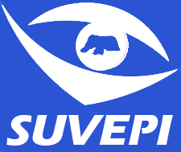

<div id="header" align="center">
  </img>
</div>

```javascript
export default async function myTechnologies(token){
    return fetch('https://isaacreinaldo.dev/me/technologies', {
        method: 'GET',
        headers: {
            'Authorization': `Bearer ${token}`,
            'Content-Type': 'application/json'
        },
    });
}
console.log(myTechnologies(rightToken))
```
```json
{
  "languages": ["Python", "JavaScript", "Java", "C", "C++"],
  "frameworks": ["Django", "ReactJS"],
  "misc": ["PostgreSQL", "Git", "ChartJS", "Styled-Components", "JQuery", "Bootstrap", "CSS", "HTML"]
}
```
<div align="center">
  <div id="badges">
    <h2>
      Welcome, I'm Isaac Reinaldo!
      
    </h2>
    <div align="center">
      
    </div>
    <a href="https://www.linkedin.com/in/isaac-reinaldo/">
        
      </a>
      <a href="https://www.instagram.com/isaacrpl7/">
        
      </a>
      <a href="mailto: isaacrpl7@hotmail.com">
        
      </a>
    </div>
    
  </div>
</div>


## Experience
### Web developer


I've been working as a Full-Stack developer of [SUVEPI](https://suvige.imd.ufrn.br), a website that helps notifying and monitoring the Covid-19 cases and other diseases. It assisted a lot of health professionals all around the state and is used by the official health department [SESAP-RN](http://www.saude.rn.gov.br).

```python
from datetime import date
start_date = date(2021, 04, 01)
today = date.today()
```

---

### Django developer


I worked as a Django developer of União Rações, a system that managed and calculate data of products, sales and clients to a farm. I was part of all the development steps, including modeling, setting, implementing, developing dashboards and calculations.

```python
from datetime import date
start_date = date(2020, 08, 01)
end_date = date(2020, 12, 01)
```

---

<div align="center">
  &nbsp;
  &nbsp;
  &nbsp;
  &nbsp;
  &nbsp;
  &nbsp;
  &nbsp;
  &nbsp;
  
  
  
  
  
</div>
<!--
**isaacrpl7/isaacrpl7** is a ✨ _special_ ✨ repository because its `README.md` (this file) appears on your GitHub profile.

Here are some ideas to get you started:

- 🔭 I’m currently working on ...
- 🌱 I’m currently learning ...
- 👯 I’m looking to collaborate on ...
- 🤔 I’m looking for help with ...
- 💬 Ask me about ...
- 📫 How to reach me: ...
- 😄 Pronouns: ...
- ⚡ Fun fact: ...
-->
